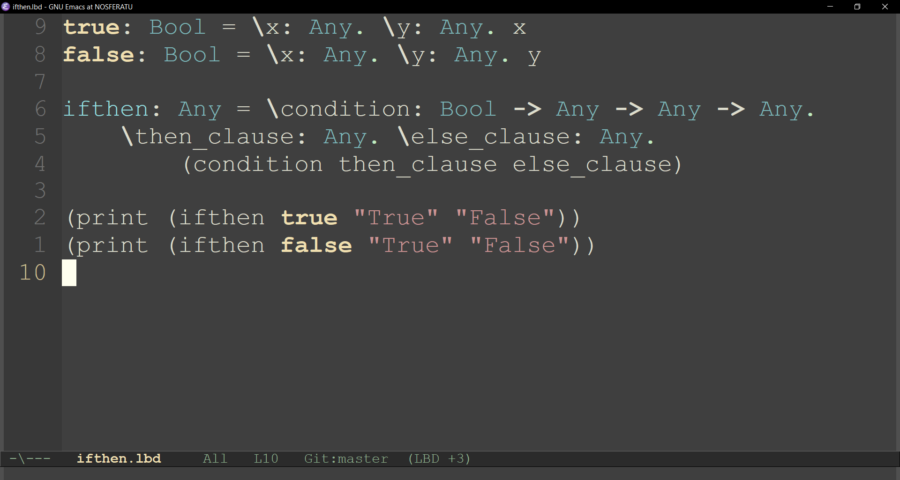

## Lambda Discipline major mode for GNU emacs

### Getting started

1. Open `lbd-mode.el` with `C-x C-f`.
2. Evaluate the buffer with `M-x eval-buffer RET`.
3. Enable the major mode with `M-x lbd-mode RET`.
